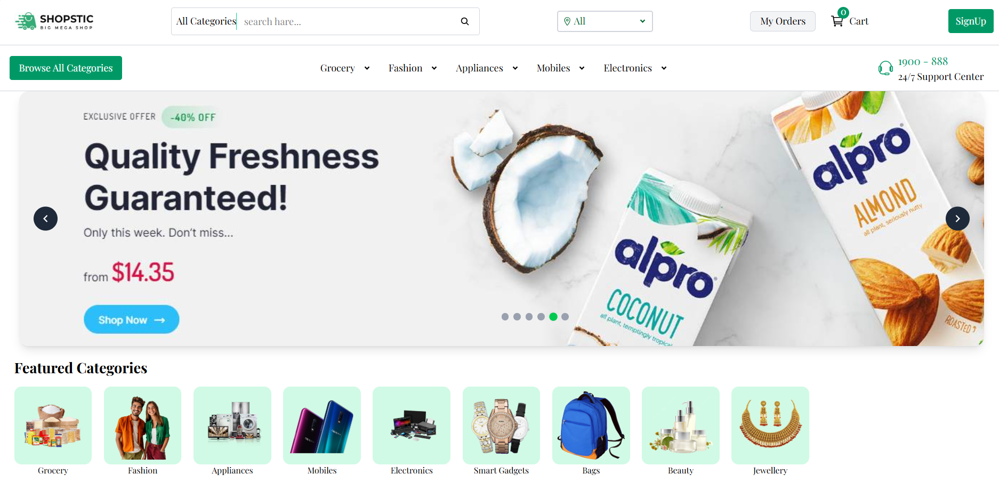
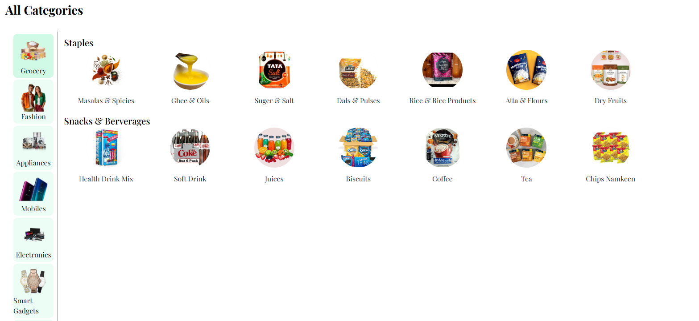
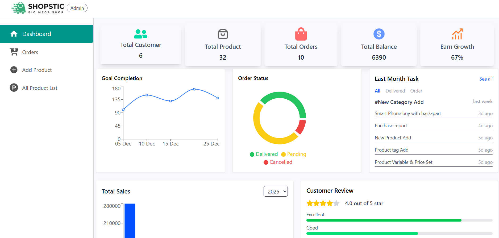
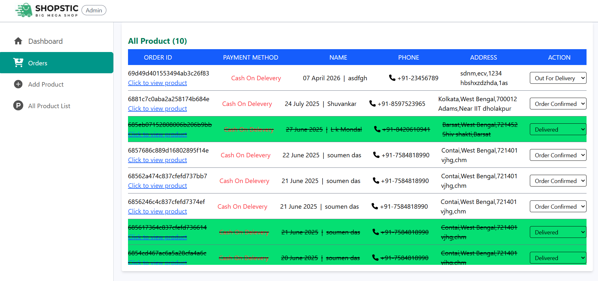

# E-Commerce Web Application

A full-stack **MERN E-commerce platform** with advanced product categorization, search & filtering, authentication, and admin dashboard. Inspired by scalable platforms like Flipkart.

---

## Live Demo
🔗 https://e-commerce-frontend-10m4.onrender.com/

---

## 🛠 Tech Stack

**Frontend**

* React.js
* Tailwind CSS

**Backend**

* Node.js
* Express.js

**Database**

* MongoDB

**Authentication**

* Clerk Authentication

---

## Features

### User Features

* 🔐 Secure authentication (Clerk)
* 🔎 Search products with filters
* 🧭 Multi-level category system (Category → Subcategory → Sub-subcategory)
* 🛒 Add to Cart system
* ❤️ Wishlist functionality
* 📦 Save multiple addresses
* 💳 Checkout flow (Cash on Delivery)
* 📊 Order tracking (basic)

---

### Product System

* Structured product hierarchy (like Flipkart)
* Dynamic filtering and searching
* Category-based navigation

---

### Admin Panel

* 📊 Dashboard with profit/loss visualization (graphs)
* 👥 View all users and user data
* 📦 Manage orders
* 🔄 Update order tracking status
* 🛠 Product & category management

---

## Screenshots

---

## Future Enhancements

* 🚚 Delivery Boy Panel
* 💳 Online Payment Integration (Razorpay)
* 📍 Real-time Order Tracking (Live location)
* 📦 Advanced Shipping System
* 🔔 Notifications (Order updates)

---

## Show Your Support

If you like this project, please ⭐ the repository!
